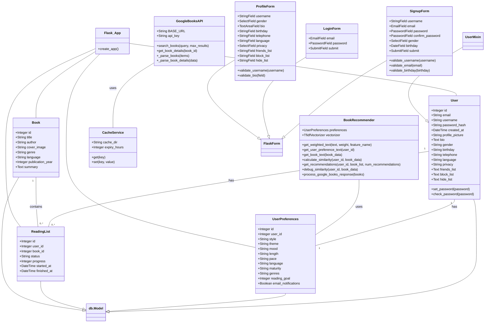
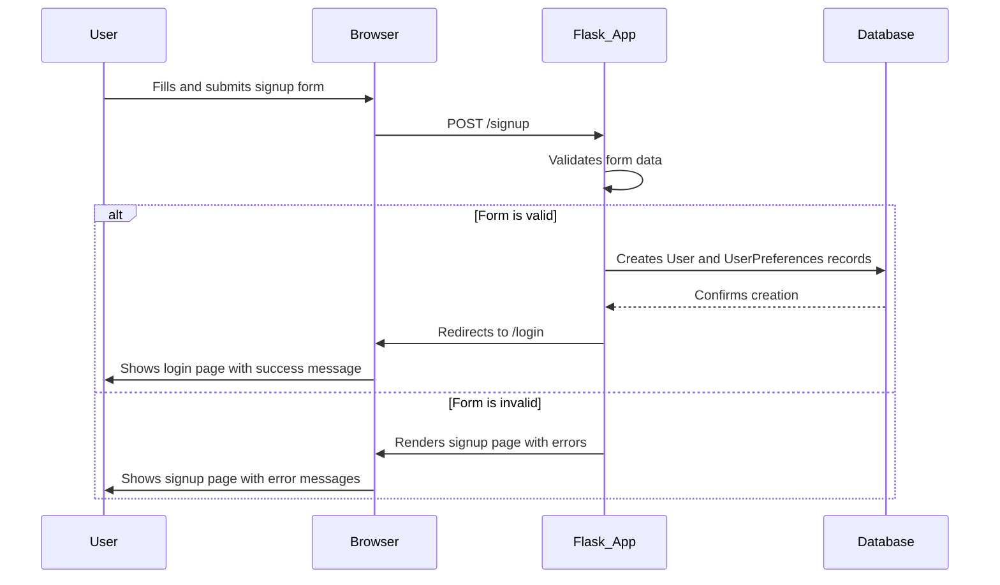
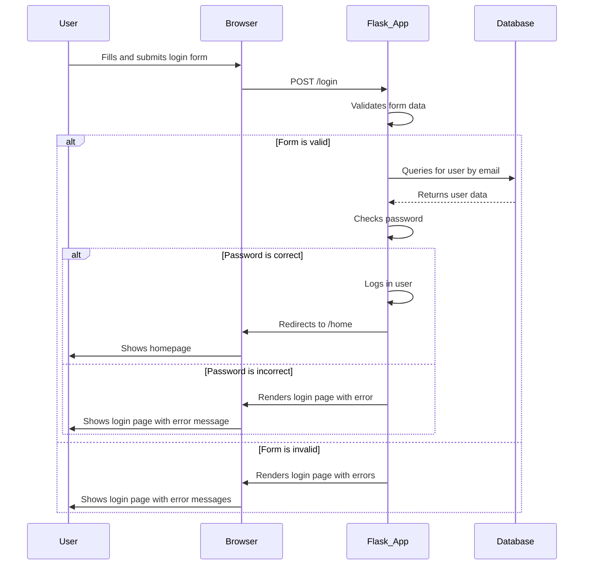
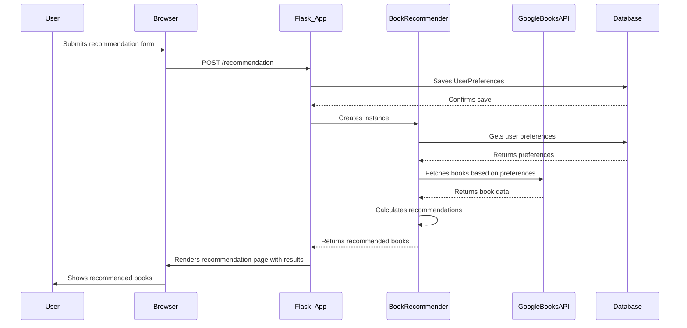
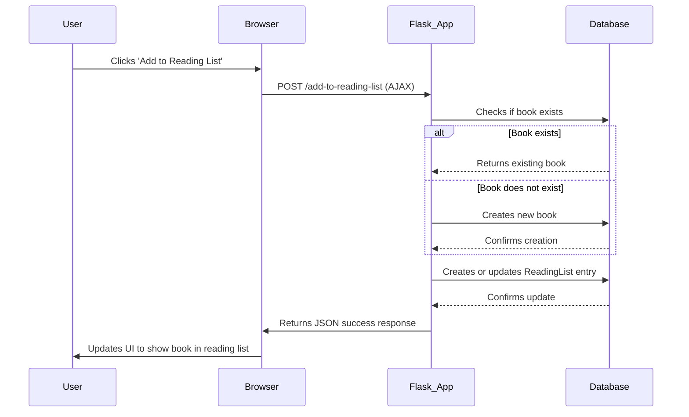
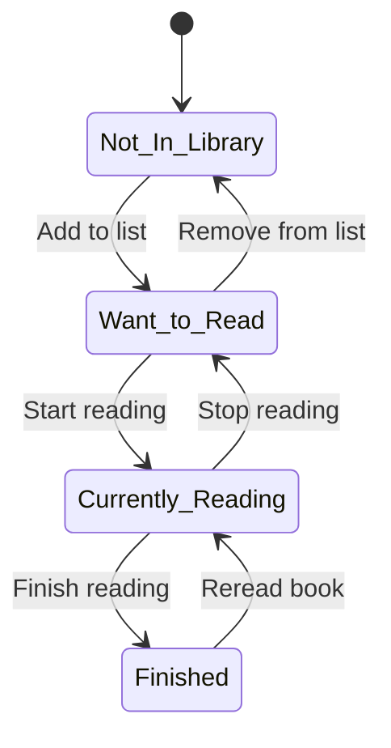

# Design
# Bookbuddy Design Document

This document contains the UML diagrams that describe the architecture and behavior of the Bookbuddy application, following the C4 model for visualizing software architecture.

---

## Level 1: System Context Diagram

This diagram provides a high-level overview of the system, showing how it interacts with its users and other systems.

```mermaid
useCaseDiagram
    actor "Guest" as Guest
    actor "Registered User" as User

    User --|> Guest

    rectangle "Bookbuddy System" {
        usecase "Search for Books" as UC1
        usecase "View Book Details" as UC2
        usecase "Register Account" as UC3
        usecase "Log In" as UC4
        usecase "Manage Profile" as UC5
        usecase "Manage Reading List" as UC6
        usecase "Get Book Recommendations" as UC7
        usecase "Log Out" as UC8
    }

    Guest -- (UC1)
    Guest -- (UC2)
    Guest -- (UC3)
    Guest -- (UC4)

    User -- (UC5)
    User -- (UC6)
    User -- (UC7)
    User -- (UC8)
```

---

## Level 2: Container Diagram

This diagram zooms into the system to show the high-level containers (applications, data stores, etc.) and their interactions.

```mermaid
deploymentDiagram
    node "User's Computer/Mobile" {
        artifact "Web Browser" as Browser
    }

    node "Cloud Platform (e.g., Vercel)" {
        node "Application Server" {
            artifact "Bookbuddy Flask App" as App
        }
        node "Database Server" {
            artifact "Bookbuddy DB" as DB
        }
    }

    node "Google's Infrastructure" {
        artifact "Google Books API" as GoogleAPI
    }

    Browser ->> App : HTTPS
    App ->> DB : DB Connection
    App ->> GoogleAPI : API Requests (HTTPS)
```

---

## Level 3: Component & Package Diagrams

These diagrams zoom into a container to show the components and packages within it.

### Component Diagram

This diagram illustrates the major components of the Bookbuddy application and their dependencies.

```mermaid
componentDiagram
    actor User

    node "Client Device" {
        [Web Browser] as Browser
    }

    node "Web Server (e.g., Vercel)" {
        package "Flask Application" {
            [Routes]
            [Forms]
            [Models]
            [Services]
        }
        [Database (SQLite)]
    }

    node "Google Cloud" {
        [Google Books API]
    }

    User -->> Browser
    Browser -->> Routes : HTTP Requests
    Routes -->> Forms : Validation
    Routes -->> Services : Business Logic
    Routes -->> Models : Data Access
    Services -->> Models
    Services -->> [Google Books API] : External API Calls
    Models -->> [Database (SQLite)] : CRUD Operations
```

### Package Diagram

This diagram shows the structure of the codebase in terms of packages (namespaces or folders).

```mermaid
packageDiagram
    package "Bookbuddy" {
        package "routes" {
            [books.py]
        }
        package "services" {
            [google_books.py]
            [cache_service.py]
        }
        package "templates" {}
        [app.py]
        [models.py]
        [forms.py]
        [config.py]
        [extensions.py]
        [Recommendation.py]
    }

    [app.py] --> [routes.books.py]
    [app.py] --> [models.py]
    [app.py] --> [forms.py]
    [app.py] --> [Recommendation.py]
    [routes.books.py] --> [services.google_books.py]
    [services.google_books.py] --> [services.cache_service.py]
    [Recommendation.py] --> [models.py]
```

---

## Level 4: Code (Class Diagrams)

This diagram zooms into a component to show the implementation details.



---

## Behavioral Diagrams

These diagrams describe the behavior of the system.

### Sequence Diagrams

Sequence diagrams illustrate how objects interact with each other over time. These diagrams show the sequence of messages exchanged between objects to perform a specific task.

#### User Signup


#### User Login


#### Book Recommendation


#### Adding a Book to Reading List


### Activity Diagrams

Activity diagrams describe the flow of control in a process. They are useful for modeling the business logic and workflows of the application.

#### User Registration
```mermaid
activityDiagram
    title User Registration

    start
    :User navigates to signup page;
    :Fills in registration form;
    :Submits form;
    if (Form validation fails) then (no)
        :Show error messages;
        :User corrects information;
        stop
    else (yes)
        :Create new User object;
        :Hash password;
        :Create UserPreferences object;
        :Save User and UserPreferences to database;
        :Redirect to login page;
        :Show success message;
    endif
    stop
```

#### User Login
```mermaid
activityDiagram
    title User Login

    start
    :User navigates to login page;
    :Fills in login form;
    :Submits form;
    :Query database for user by email;
    if (User exists) then (yes)
        :Check password;
        if (Password is correct) then (yes)
            :Log in user;
            :Redirect to homepage;
        else (no)
            :Show invalid credentials error;
        endif
    else (no)
        :Show invalid credentials error;
    endif
    stop
```

#### Book Recommendation
```mermaid
activityDiagram
    title Book Recommendation

    start
    :User navigates to recommendation form;
    :Fills in preferences;
    :Submits form;
    :Save UserPreferences to database;
    :Get search queries from preferences;
    :Fetch books from Google Books API;
    :Process and clean book data;
    :Calculate similarity between user preferences and books;
    :Sort books by similarity;
    :Select top recommendations;
    :Render recommendation page with results;
    stop
```

#### Adding a Book to Reading List
```mermaid
activityDiagram
    title Adding a Book to Reading List

    start
    :User searches for a book;
    :User clicks 'Add to Reading List' button;
    :Send AJAX request to /add-to-reading-list;
    :Check if book exists in database;
    if (Book does not exist) then (yes)
        :Create new Book object;
        :Save book to database;
    endif
    :Check if ReadingList entry exists for user and book;
    if (Entry exists) then (yes)
        :Update status of existing entry;
    else (no)
        :Create new ReadingList entry;
        :Save entry to database;
    endif
    :Return JSON success response;
    :Update UI to reflect change;
    stop
```

### State Diagram

This state diagram shows the transitions between states of a `Book` object within a user's reading list.

#### Book Status in Reading List



*   Monitor API responses


This recommendation system prioritizes finding books that closely match user preferences while ensuring content quality and relevance through multiple layers of filtering and matching.
